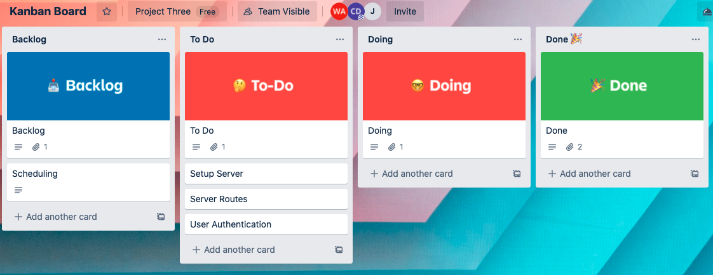

### GA SEI PROJECT THREE

# MEP - MATERIAL EQUIPMENT PRESERVATION

[GitHub repository](https://github.com/jedediahriley/project_three)

[Heroku site](https://dashboard.heroku.com/apps)

## The Project
The object of this project is to develop a full-stack application that will enable a company to:
1. Track project-specific equipment.
2. Track preservation maintenance of such equipment.
3. Track preventive maintenance of the equipment.

## Technologies Used
This project will use the following technologies:

- MERN stack: Node.js, Mongo/Mongoose, Express and REACT.
- MVC file structure: Models, Views, Controllers.
- Full CRUD functionality: Create, Read, Update, Delete.
- Authorization functionality, with encrypted password and authorization flow.
- GitHub for version control.
- Online deployment via Heroku.

### Trello
Trello will be used to gauge progress of the project.

## Team
This will be a group project that will showcase the ability to collaborate as a team in the development of the application.  Team members and their initial respective development areas are:

+ Jedediah Riley
    + GitHub management
    + Heroku deployment
    + CSS styling
    + Middleware

+ Corwin Dickey
    + Authorization
    + Front-end functionality
    + Trello board maintenance

+ Walter Arenas
    + Back-end functionality
    + Documentation

# User Types and Access levels
There will be two type of users for this app. The types of users and the user's authorization levels are as follows:
- End User - Read and Update
- Site Admin - Create, Update, Read and Delete

## User Stories

### End User
As an end user, I will be able to:
- log in into my account
- see the list of equipment that needs to be maintained
- see the location of the equipment that needs to be maintained
- see a picture of the equipment that requires maintenance
- see the type of maintenance that is required for each equipment
- click on a button to communicate that maintenance has been completed on a particular equipment
- enter the date when the maintenance was completed
- log out of my account

### Site Administrator
As a site administrator, I will be able to:
- log in into my account
- create new equipment
- accept equipment or reject it due to damage
- include a picture of the equipment
- add a unique tag to identify the equipment
- indicate the vendor from whom the equipment was purchased
- indicate the equipment's purchase order number
- indicate the location where the equipment will be warehoused
- determine if the equipment should be housed indoors or outdoors
- create a maintenance schedule
- assign who will take care of the maintenance
- give instructions as to the type of maintenance that will be needed.
- log out of my account

